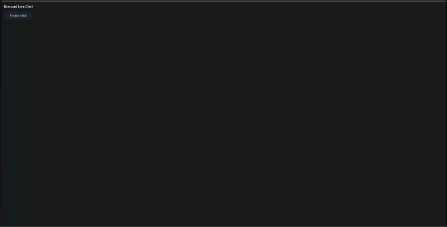

<h1>Nimcord live chat</h1>

 
<h3>It was developed used both frontend and backend properties with flet</h3>
 

 

This is a simple chat, that can only be used on devices that are connected on the same wifi, and its only for live conversations

